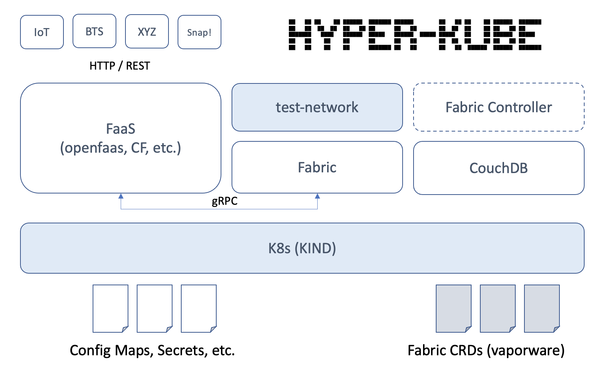
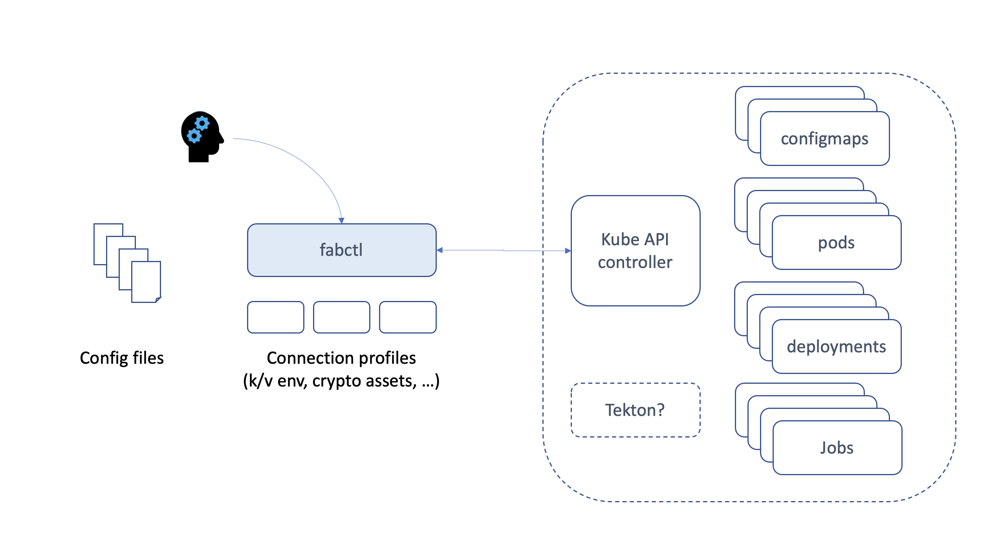

# HYPER KUBE

**Hyperkube** provides a collection of utilities, libraries, and configurations to operate Hyperleder Fabric as a 
_Kube-native_ platform.

This project is **very new** and currently in genesis / experimental status.  Contributions, feedback, and reviews are 
both welcome and encouraged.

## Overview: 
Hyperkube provides: 

- Reference patterns for deployment to provider-agnostic Kubernetes clusters.
- Simplified operational practices for common fabric activities (network, channel, and chaincode lifecycle.)
- A common, unified approach for configuration, connection profiles, and remote administration.
- _Kube Native (but not Kube Only)_ operational practices.
- A Fabric reference network, equivalent to [test-network](url), suitable for local application development.
- A focused environment for development and management of [external chaincode](url) smart contracts. 

## Objectives:

- Build and maintain momentum for a migration from Docker (compose/swarm/virtualbox) to Kubernetes 
- Provide vendor-agnostic patterns for running Fabric on Kubernetes.
- Study of fabric configuration : catalog for fragmented configuration files, utilities, and patterns. 
- Constrain / eliminate reliance on local Docker daemon (and docker-in-docker) to advance _chaincode as a service_ 
  deployment practices.
- Provide near-term value with local, CLI-based Kubernetes control interfaces.
- Provide long-term value by aligning with the kube-native "Operator Pattern" 

## Mechanics: 

Hyperkube provides the `fabctl` command for instantiating and manipulating hyperledger networks running somewhere "in 
the cloud."  In traditional fabric networks, a network administrator is responsible for crafting a configuration, 
determining port mappings, managing crypto certificates and key specs, managing the lifecycle of application components,
and running a series of `peer` CLI binaries to reflect updates and configuration across a collection of machines.
This administration burden is tremendous!

`fabctl` reduces the complexity of operations by providing a single entrypoint for common fabric objectives, communicating 
entirely with the Kubernetes API Controller to affect changes in a remote cluster.  By implementing fabric 
activities as Kube API calls, the system is entirely vendor-agnostic, language-neutral, and compatible with community 
best practices for remote cluster management.

Hyperkube is NOT a [Kubernetes Operator](https://kubernetes.io/docs/concepts/extend-kubernetes/operator/).  In early 
genesis, this project is an assembly area for cataloging reference practices, codifying an API bridge to k8s, and 
providing a practical gateway for interacting with a remote Fabric network.  With this in mind, it is a stated goal 
of this project to **align** with the operator pattern, such that the routines and functionality implemented by `fabctl` 
may be refactored into a first-class controller and collection of K8s CRDs.

The general structure of `fabctl` divides Fabric administration activities into three functional sub-areas: 
- `network` 
- `channel`
- `chaincode`

To affect changes in a fabric network, the administrator applies a series of local configuration files, selects a 
_connection profile_, and issues `fabctl` commands to reflect the change in a remote cluster.  All API updates to k8s
are made via a Kubernetes API client, inheriting the current `kubectl` context and configuration.

## Notes / Scratch / TODO: 

- Developed in golang as a go neophyte.  (Would consider Java + Fabric8 for rapid development, but chose to align with Fabric patterns.)
- Hyperkube will use the [Tekton Operator](https://tekton.dev) to run `Tasks` on K8s.  (Currently k8s batch Job CRDs)
- Consider using [Argo Workflows](https://argoproj.github.io/workflows) to run `Workflows` on K8s (not Jobs, not tkn Tasks, ...)
- Hyperkube uses [KIND](https://kind.sigs.k8s.io) as a development platform.  Write a KIND.md or QUICKSTART.md 
- Start with [test-network-kind](https://github.com/hyperledger/fabric-samples/pull/471) and use `fabctl` to emulate `network.sh` 
- Install [asset-exchange-basic](link) and integrate with [rest-sample-application](link) to illustrate high-level dev activities.
- Supplement / Pattern on [Fabric Getting Started - Run Fabric](https://hyperledger-fabric.readthedocs.io/en/latest/test_network.html) - reduce to **minimal** fabctl activities. 
- Link up with practices from [weft](link) for management and conversion of fabric connection descriptors.
- Link up with IDE integration (e.g. VSCode extension)
- Link up with ephemeral Fabric instances on cloud (e.g. fab-playground)